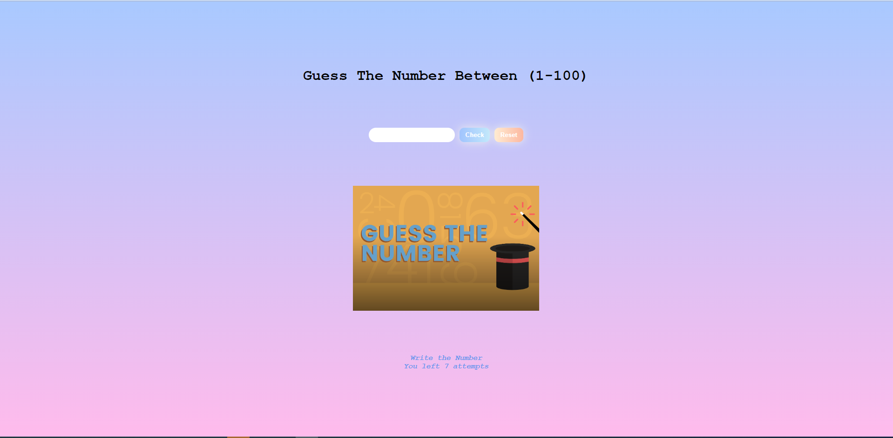

[👉 click here to view the page](https://msaiduslu.github.io/Guess-The-Number-Game/)

# Project : Find the Number Game

## Description

Project aims to create find the number game (between 0 to 100).

## Project Skeleton

```
|
|----readme.md
|----index.html
|----style.css
|----index.js
```

## Objective

Build a Find the Number Game (Between 0 to 100)

### At the end of the project, students i will be able to;

- improve coding skills within HTML & CSS & JS

- use git commands (push, pull, commit, add etc.) and Github as Version Control System.
